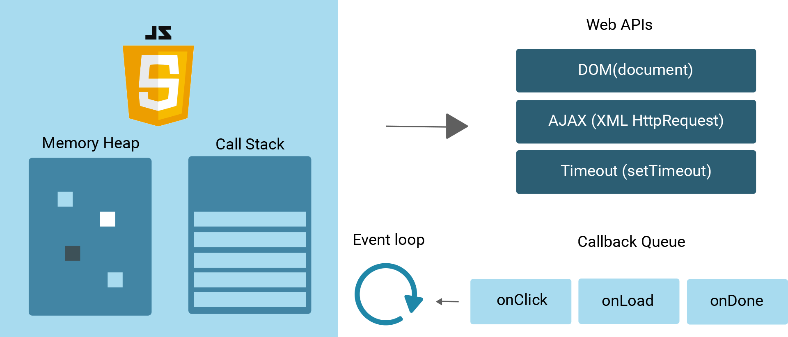

# Chapter 17

### Building Blocks of JS
 An example of how each part plays a role in how Javascript works.

JavaScript is comprised of three data structures: a stack, a queue, and a heap.
Stack and Queue are linear data structures because they have a start and end. A heap is a 
2D structure with a hierarchical organization.
#### Call Stack
This data structure adds and removes data from only one end of the structure, like taking chips out a 
Pringles can. This type of operation is called FILO: First in, Last out
The pop() method removes items from the same end targeted by push.
#### Callback Queue
This data structure adds data at one end of the structure and removes data from the other, like water
flowing through a garden hose. This type of operation is called FIFO: First in, First out
The shift() method removes items from the front of the array queue and push adds elements to the end.  

#### a Closure 
is a function that contains references to its surrounding state. Created when a function is returned.
Lets us access the outer scope containing the variable count.
  For Example:  
 function counter() { 
   let count = 0; 
   return function() { 
     return count++; 
   } 
 }  
the surrounding lexical environment here would belong to counter, which is { count: 0, anonymous(): f() { return count++; }. Note how in the closure function we return count, a variable not initialised in the closure. 

##### Benefits of Closure 
Prevent polluting the global namespace that can cause collisions due to name conflicts 

Accidental modifications of global variables 

Performance gains when accessing local variables vs. lookups on the global scope 

#### Factory Function
a function that produces objects, returns object literals 
const tiger = function() {
  const noise = 'roar'; 
  return { 
    sound: function() { 
      console.log(noise); 
    }, 
  } 
} 

const tigger = tiger();
tigger.sound(); //=> "roar"
### Other Definitions 
Thread of Execution TOE - the line of code currently being executed.

Inheritance - when you design your types based on what they are

Composition - when you design your types based on what they can do

event loop
web api
node.js core modules

